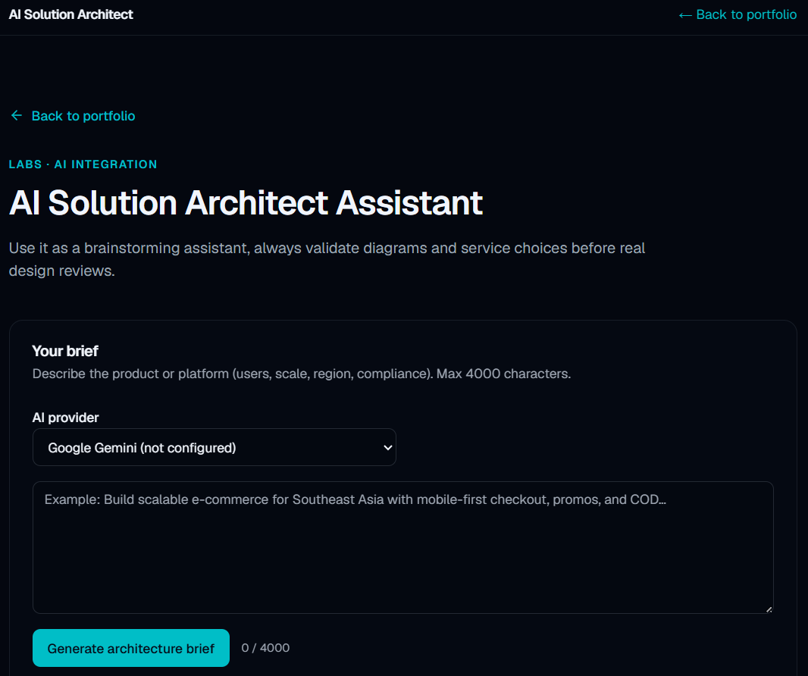

# AI Solution Architect


Paste a product brief and get a structured architecture recommendation — stack, AWS services, scaling notes, and a live Mermaid diagram — powered by an LLM (Google Gemini, Groq, or NVIDIA NIM).

**Tech stack:** `Next.js` · `TypeScript` · `Tailwind v4` · `Zod` · `Mermaid` · `LLM APIs`



## Features

- Describe any system in plain language and get a structured architecture brief back.
- Choose your LLM provider at request time: Google Gemini, Groq, or NVIDIA NIM.
- Server-side JSON validation with Zod — malformed model output is rejected before it reaches the UI.
- Live Mermaid architecture diagram, sanitized and rendered in the browser (with "Copy Mermaid" and "Download JSON").
- Distributed rate limiting via Upstash Redis to protect your API keys.
- Secrets stay server-side: keys are read inside the API route, never shipped to the client.

## Getting started

```bash
git clone https://github.com/metz97/lab-architect.git
cd lab-architect
npm install
cp .env.example .env.local
# add at least one LLM API key (and Upstash Redis creds for the POST endpoint)
npm run dev
```

Then open http://localhost:3000.

> The demo requires at least one LLM API key (Gemini, Groq, or NVIDIA NIM). The generate endpoint also requires Upstash Redis credentials for rate limiting.

## Environment variables

| Name | Required? | Description |
| --- | --- | --- |
| `GEMINI_API_KEY` | One provider key required | Google Gemini API key. |
| `GEMINI_MODEL` | Optional | Gemini model override (default `gemini-2.0-flash`). |
| `GROQ_API_KEY` | One provider key required | Groq API key. |
| `GROQ_MODEL` | Optional | Groq model override (default `llama-3.3-70b-versatile`). |
| `NVIDIA_API_KEY` | One provider key required | NVIDIA NIM API key. |
| `NVIDIA_BASE_URL` | Optional | NVIDIA base URL (default `https://integrate.api.nvidia.com/v1`). |
| `NVIDIA_MODEL` | Optional | NVIDIA model override (default `meta/llama-3.1-8b-instruct`). |
| `ARCHITECT_PROVIDER` | Optional | Default provider: `gemini`, `groq`, or `nvidia` (default `gemini`). |
| `UPSTASH_REDIS_REST_URL` | Required for POST | Upstash Redis REST URL (rate limiting). |
| `UPSTASH_REDIS_REST_TOKEN` | Required for POST | Upstash Redis REST token. |
| `ARCHITECT_RATE_LIMIT_MAX` | Optional | Max requests per window (default `1`). |
| `ARCHITECT_RATE_LIMIT_WINDOW_MS` | Optional | Rate-limit window in ms (default `60000`). |
| `NEXT_PUBLIC_PORTFOLIO_URL` | Optional | URL for the "Back to portfolio" link. |

At least one provider key is required. The `/api/architect` POST endpoint returns `503` if Upstash Redis is not configured.

## Testing

```bash
npm run test
```

Unit tests cover the Mermaid sanitizer, the Zod brief schema, and the provider helpers. They run fully offline — no network or secrets needed.

## How it works

1. The client posts your brief (and chosen provider) to `POST /api/architect`.
2. The route rate-limits by IP (Upstash Redis), then calls the selected LLM with a system prompt that requests a strict JSON shape plus a Mermaid flowchart.
3. The model's response is parsed and validated against a Zod schema (`architect-schema.ts`); invalid JSON is rejected with a clear error.
4. The validated brief is rendered as sections, and the Mermaid source is sanitized (`mermaid-sanitize.ts`) and rendered live in the browser.

## Part of my portfolio

This is a standalone extract of the "AI Solution Architect" lab from my portfolio.
See more: [https://khalidahmad.dev](https://khalidahmad.dev)

## License

MIT — see [LICENSE](./LICENSE).
